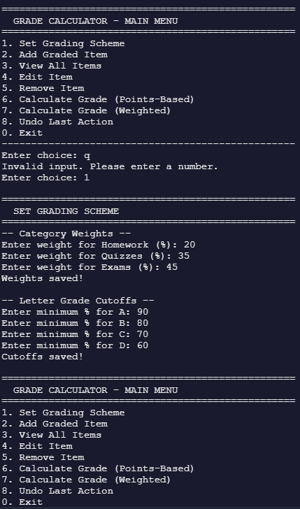
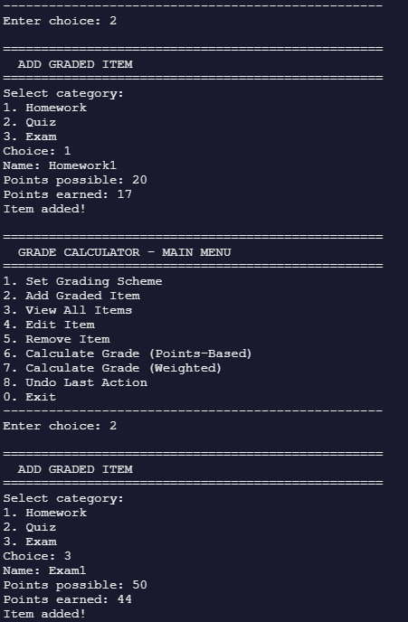
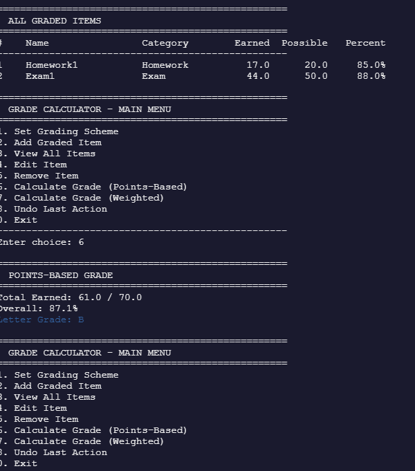

## Introduction:
This is a program that takes entered grades for homework, quizzes, and exams and calculates what the overall grade would be with the given information, along with having the options to undo and edit already entered assignments.

## Getting Started:
In order to properly build the program, use g++ for Linux, MacOs, Wsl, and MinGW: g++ -std=c++17 *.cpp -o GradeCalculator
As for running it, use ./GradeCalculator for MacOs / Linux, and GradeCalculator.exe for Windows

## Menu Walkthrough
1. Set Grading Scheme ||Allows the user to set percentage weights for each assignment category, along with minimum requirements for each letter grade||
3. Add Graded Item ||Allows the user to add assignments, total points possible, and points earned into the program||
4. View All Items ||Shows all of the currently listed assignments||
5. Edit Item ||Allows the user to edit a previously entered assignment||
6. Remove Item ||Removes a specific item from the list||
7. Calculate Grade (Points-Based) ||Calculates the overall grade based on the total number of points and total number of points earned|| 
8. Calculate Grade (Weighted) ||Calculates the overall grade based on percentage||
9. Undo Last Action ||Undoes the last action done by the user||
0. Exit ||Exits the program||

## Sample Session:

## Sprint Enhancements
ANSI color coding: Helps easily tell what letter grade was achived with each one being a different color
Undo option: Reverses the last add or remove action
Edit option: Allows the user to edit the name, total points possible, and points earned for an assignment
Filter: Prevents non-numerical characters from being entered when the program is expecting a number, such as choosing an option for the menu

## Understanding Results
Points based results will output a result such as 55 / 60 along with an overall percentage and letter grade
Weighted based results will output the averages of each assignment type, how much each of them weighs, a final weighted grade, such as 73.1%, and a letter grade

## Know Limitations
The program does have some limitations, such as not being able to handle large decimals, and is not fully optimized. There are also some issues with the save/load function so keep these in mind

## Troubleshooting
Common mistake 1: Accidentally removing an item can be undone with the undo function
Common mistake 2: Accidentally entering in the wrong name / points for an assignment can be fixed with the edit function
